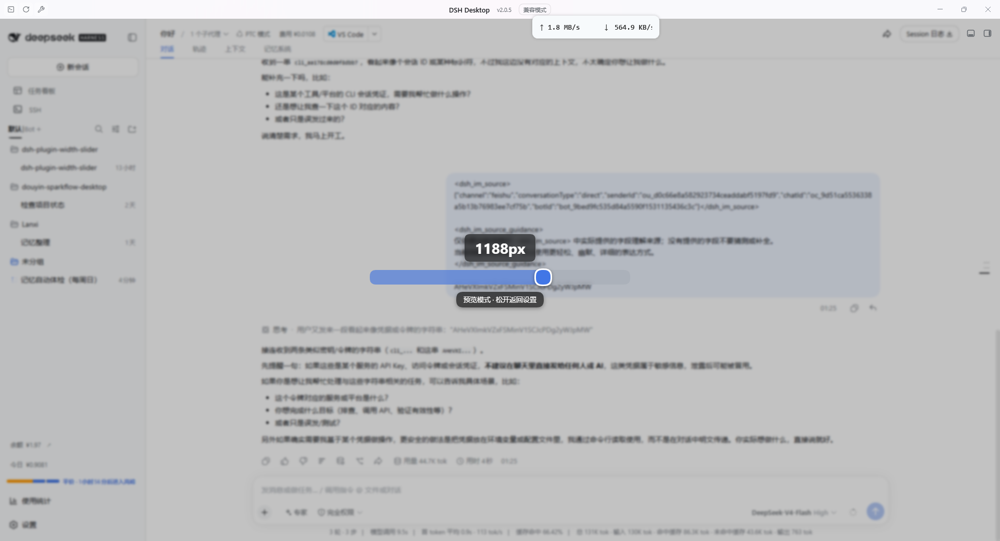
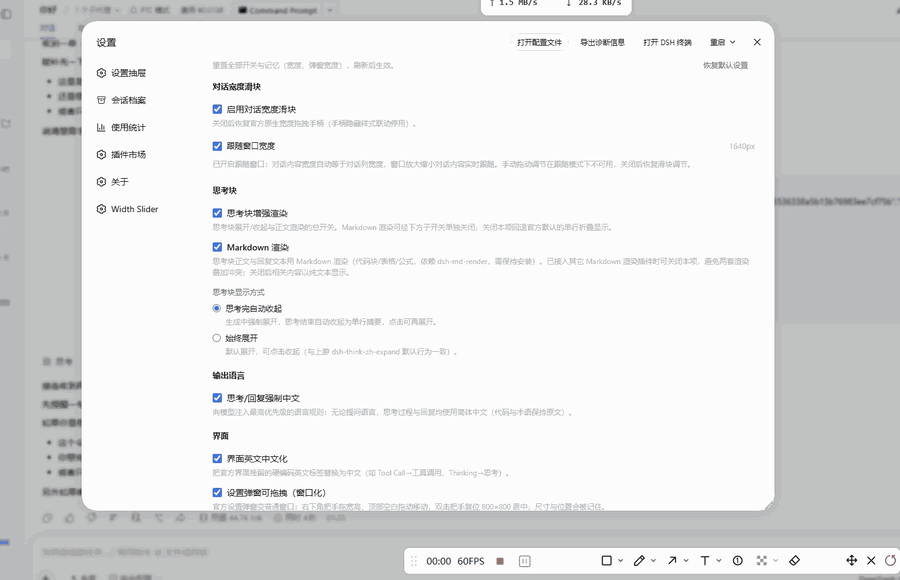
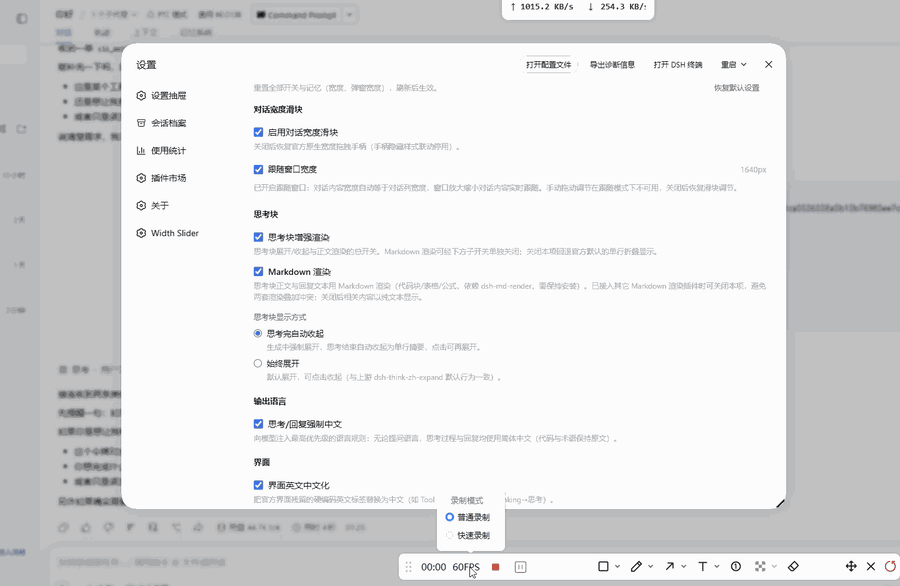
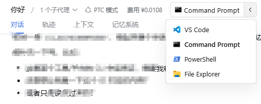
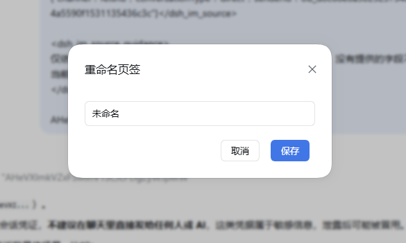
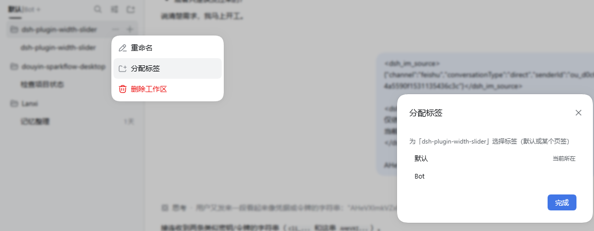
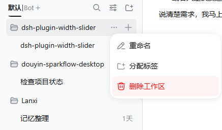

# dsh-plugin-width-slider

**DSH 个人多功能插件**（v0.3.0 起整合 dsh-think-zh-expand 能力、v0.4.0 起整合 dsh-plugin-open-with 能力、v0.5.0 起内置会话删除、v0.6.0 起内置工作区分页；全部功能带独立开关）—— 为 **DSH Desktop（Windows 桌面版）** 提供：

- **对话宽度滑块**：替代原生宽度拖拽手柄的滑块调节，按下即全屏预览、实时调宽、宽度持久化，可切"跟随窗口宽度"（重启后保持）；
- **思考块增强**（整合自 dsh-think-zh-expand）：思考与回复强制中文、思考块展开/收起（默认"思考完自动收起"）；思考块外观与官方一致（官方 DisclosureRow + 纯文本正文），正式回复走官方 Markdown 渲染，不接管围栏（genui / mermaid 等插件照常工作）；
- **Open With**（整合自 dsh-plugin-open-with）：对话头部胶囊按钮用其他应用（VS Code/终端/资源管理器/自定义项）打开当前目录；
- **界面中文化**：官方界面残留硬编码英文标签自动替换为中文；
- **官方面板补丁**：设置弹窗可拖拽调宽、左侧 tab 列表超高时滚动。
- **会话删除**（v0.5.0）：官方不支持删除会话，本插件在会话行 ⋯ 菜单补"删除会话"——二次确认后 host 执行完整删除链（停止任务/清内存/删磁盘/清投影缓存与工作区记账），不留半删残留。
- **工作区分页**（v0.6.0）：官方侧栏「工作区」标题原位替换为页签栏——固定「默认」+ 用户自建可命名页签（文件夹）收纳工作区；工作区唯一归属（默认或某一页签），行菜单「分配标签」移动归属；删除页签时其中工作区自动回默认；在其它页签新建工作区会自动归入当前页签。

安装 dsh-plugin-width-slider 后即可替代 dsh-think-zh-expand 与 dsh-plugin-open-with（无需再单独安装，见下方"与上游插件的关系"）。

---

## 适用环境

| 项目 | 要求 |
|------|------|
| 运行环境 | **DSH Desktop**（DeepSeek Harness 桌面版，Windows 10/11） |
| DSH Desktop 仓库 | [anywhere-labs/dsh-desktop](https://github.com/anywhere-labs/dsh-desktop) |
| DSH 版本 | `>= 0.1.1-rc.1` |
| Node.js | `^22.11 \|\| >= 24` |
| 平台 | 仅 `win32` |

> 验证状态：宽度滑块、思考块增强与面板补丁已在 DSH Desktop 上实测；Open With（v0.4.0 整合）主要流程已由作者真机验证；
> 会话删除（v0.5.0）、近期修复（宽度启动恢复、Open With 即时同步）与工作区分页（v0.6.0）由作者验收中。
> 若你的 DSH 是自建/Web 版，机制相同（同为 Web 端注入），但以桌面版为准验证。

---

## 功能特性（全部可独立开关）

| 开关 | 功能 | 默认 |
|---|---|---|
| 宽度滑块 | 滑块调节对话内容宽度：按下即全屏预览、实时调宽、宽度持久化，可切"跟随窗口宽度"模式；重启 DSH 后启动即应用上次设置（无需打开设置页）；关闭后恢复原生拖拽手柄 | 开 |
| 强制中文 | host 注入最高优先级语言规则：思考过程与回复均使用简体中文 | 开 |
| 思考块增强 | 思考块展开/收起交互（默认"思考完自动收起"）；头部用官方 DisclosureRow + 官方思考图标、正文纯文本，外观与官方一致；正式回复走官方 Markdown 渲染，不接管围栏 | 开 |
| 思考块模式 | 二选一：思考完自动收起（默认）/ 始终展开 | 自动收起 |
| 界面中文化 | 官方残留硬编码英文标签（Tool Call、Thinking 等）替换为中文 | 开 |
| 弹窗窗口化 | 官方设置弹窗变可拖拽窗口：右下角把手调宽高、顶部拖动移动、双击复位 800×800 居中（记忆） | 开 |
| tab 滚动 | 官方设置左侧 tab 列表超高时显示滚动条 | 开 |
| Open With 按钮 | 对话头部胶囊按钮（主按钮启动当前项 / 右侧箭头展开菜单切换），在当前会话目录启动 | 开 |
| Open With 设置 | 总控页管理打开项：预设/自定义、组内拖拽排序、设为当前、隐藏、添加/编辑/删除；改动即时同步到已挂载的头部按钮（含其它窗口） | 开 |
| 会话删除 | 会话行 ⋯ 菜单新增"删除会话"项：二次确认后永久删除会话及数据（官方不支持删除，由本插件补全） | 开 |
| 工作区分页 | 官方侧栏「工作区」标题变为页签栏：固定「默认」页签 + 可新建/重命名/删除的命名页签（文件夹）；工作区唯一归属，行菜单「分配标签」移入任意页签或回默认；删除页签其中工作区自动回默认；在其它页签新建工作区自动归入该页签；重启后回到默认页签 | 开 |
| 动效 | 对话入场 / 侧边栏 / 新建对话 / 设置界面四组入场动效，各带独立样式选择（共 12 种），另有流畅 / 优雅 / 极简三套一键预设；整合自 [dsh-client-ui-custom](https://github.com/yoli-mi/dsh-client-ui-custom) | 全开 |

开关在 DSH 设置 → **对话宽度（Width Slider）** 区块内的功能总控页操作，改动即时生效、重启保留。

- **按下即预览**：鼠标按下滑块瞬间进入全屏预览模式——官方设置面板被临时隐藏，只留下居中的滑块、当前宽度数值与提示，对话区域完全露出，所见即所得。
- **实时调宽**：拖动滑块，对话内容区宽度即时变化（写 conversation root 元素内联 CSS 变量 `--dsh-chat-user-width`，与原生拖拽同一生效路径，无需切换会话）。
- **宽度持久化**：宽度值写入 `localStorage` 键 `dsh.conversation.contentWidth`，重启 DSH 后保留（启动即应用）。
- **跟随窗口宽度**：勾选后内容宽度实时等于对话列宽（窗口缩放/侧栏折叠/分栏切换均跟随，重启后同样保持）；偏好存 `dsh.conversation.contentWidthFollow`。
- **隐藏原生手柄**：插件入口注入全局样式 `[data-width-handle]{display:none!important}`，用稳定属性选择器隐藏原生左右拖拽手柄——不像改官方 `client.js` 那样会被升级覆盖。
- **思考块**：生成中强制展开、结束后按所选模式显示；头部用官方 `DisclosureRow`、正文纯文本（与官方 `ReasoningRow` 一致）；正式回复文本走官方 `MarkdownText` 渲染（官方 DOM 结构），代码块/表格/公式由官方管线处理，围栏渲染完全交给 genui / dsh-mermaid-render 等专门插件，不存在两套 Markdown 渲染叠加。
- **中英双语**：内置 zh / en 两套界面文案，跟随 DSH 界面语言自动切换。
- **滑块几何**：轨道高度 = 圆形手柄直径（面板 20px / 预览 28px），填充条右端为与手柄同心同半径的半圆头，无平直切面露出；宽轨道便于鼠标点击。

## 与 dsh-think-zh-expand 的关系

从 v0.3.0 开始，dsh-think-zh-expand 的全部能力（中文提示 / 思考块渲染 /
界面中文化）已并入本插件（该插件以 MIT 许可发布，版权归属声明见
[THIRD_PARTY_NOTICES.md](./THIRD_PARTY_NOTICES.md)），**不需要再单独安装
它**。若之前装过，请将其移除或停用，避免两个插件同时接管同一块界面。

本插件不实现自己的 Markdown 渲染，也不接管围栏渲染：正式回复文本经官方
`MarkdownText` 渲染（官方 DOM 结构），思考块正文与官方 `ReasoningRow` 一样
是纯文本，围栏（`dsh-ui` / `mermaid` 等）留给 genui、dsh-mermaid-render 等
专门插件扫描接管，因此不会出现两套渲染互相压制的冲突。

## 与 dsh-plugin-open-with 的关系

本插件从 v0.4.0 起已内置 **Open With（打开方式）** 的全部能力——对话头部
的"打开"胶囊按钮、以及设置里对打开项的管理。**装了本插件就不用再装
dsh-plugin-open-with**。

如果之前装过 dsh-plugin-open-with，请把它停用或卸载，避免出现两个按钮、
两套设置；你原来的打开项与排序会自动保留，不受影响。

**首次使用**：默认自带 VS Code / 终端 / PowerShell / 资源管理器四项，
点对话头部的打开按钮即可在当前目录启动；想加其它程序，到设置 →
对话宽度 → 打开方式里点"添加"，填应用名称与程序路径（.exe）即可。

## 与 dsh-client-ui-custom 的关系

从 v0.8.0 开始，参考的动效插件
[dsh-client-ui-custom](https://github.com/yoli-mi/dsh-client-ui-custom)
（对话入场 / 侧边栏 / 新建对话 / 设置面板四组动效与三套预设）已整体并入本
插件，设置项收进本插件的功能总控页。**装了本插件就不用再装
dsh-client-ui-custom**：若两者同时启用，两套引擎会对同一批 DOM 各自动画
一次，效果会叠加，请把动效插件停用或卸载。

动效设置存在本插件自己的 settings.json 里（不再占用上游的 ui-custom 设置
命名空间）；动效插件的引擎源码按 MIT 许可整合，版权声明见
[THIRD_PARTY_NOTICES.md](./THIRD_PARTY_NOTICES.md)。

---

## 安装

> 任选一种方式安装后，请**重启 DSH Desktop**（host 端 `index.mjs`、client bundle
> 与 `/width-slider`、`/open-with` RPC 均需重启生效）。

### 方式一：npm（推荐）

```bash
dsh plugin --profile desktop add dsh-plugin-width-slider
```

### 方式二：本地开发（源码目录软链）

```bash
cd C:\Users\Lanxi\.dsh\profiles\desktop
pnpm link C:\Users\Lanxi\Desktop\dsh-plugin-width-slider
```

改完代码 `npm run build` 后重启 DSH 即生效，无需复制文件。

### 方式三：手动复制（临时调试）

将构建产物复制到 profile 的 node_modules：

```
dsh-plugin-width-slider/
├── package.json
├── cordis.patch.yml
└── lib/
    ├── index.mjs     # Host 端入口
    └── client.js     # Client 端 bundle（ModuleLoader 握手）
```

复制到 `C:\Users\Lanxi\.dsh\profiles\desktop\node_modules\dsh-plugin-width-slider\`，
并在 profile `package.json` 的 `dsh.profile.bundles` 数组中追加 `"dsh-plugin-width-slider"`，重启 DSH Desktop。

---

## 使用说明

1. 打开 DSH Desktop 的 **设置** 面板。
2. 侧边栏找到 **Width Slider · 对话宽度** 条目进入 —— 这里是功能总控页：
   - **对话宽度滑块**：宽度开关 + 滑块调节（按下即全屏预览、拖动实时调宽、松开/Esc 返回）+ "跟随窗口宽度"（内容宽度实时等于对话列宽，窗口缩放/侧栏折叠均跟随）；
   - **思考块**：增强渲染开关 + 显示方式（思考完自动收起 / 始终展开）；
   - **输出语言**：思考/回复强制中文开关；
   - **界面**：英文中文化开关、设置弹窗调宽开关、设置 tab 滚动开关；
   - **打开方式（Open With）**：头部按钮开关 + 打开项管理（预设/自定义、拖拽排序、设为当前、隐藏、添加/编辑/删除；图标自动提取）；
   - **会话删除**：⋯ 菜单"删除会话"项开关（详见第 6 条）；
   - **工作区分页**：官方侧栏页签栏开关（详见第 7 条）。
3. 对话头部胶囊按钮：左侧主按钮直接在当前会话目录启动当前打开项；右侧箭头展开菜单选择其它项（选择即启动并设为当前）。按钮跟随设置即时同步——在设置面板点"设为当前"、增删改项、隐藏/显示，所有已打开会话的头部按钮（含其它窗口）立即刷新，无需切换会话或重启。
4. 调节范围（宽度滑块）：最小值 640px，最大值 = 对话列宽 − 176px（与原生拖拽一致）。
5. 设置弹窗补丁：弹窗窗口化——右下角把手拖动可同时调整宽度与高度，顶部标题区空白拖动可移动弹窗位置，双击把手复位 800×800 居中；尺寸与位置会被记住。
6. 删除会话：点击会话条目右侧"⋯"打开操作菜单，菜单末尾会出现红色的"删除会话"（与官方 重命名/分叉会话/归档会话 同级、样式一致，垃圾桶图标，无分隔线）；点击后二次确认，确认即永久删除该会话及全部数据，不可恢复。
7. 工作区分页：开启后，官方侧栏顶部「工作区」标题位置变成页签栏，最前是固定的「默认」页签，其后是你自建的可命名页签，末尾 ＋ 新建页签（新建后立即改名）。
   - 「默认」页签显示未分组的直属工作区与官方未分组会话；自建页签收纳被分配过来的工作区（同一工作区只属于一个位置）；
   - 把工作区移入某页签：展开工作区行右侧 ⋯ 菜单，点「分配标签」，在弹窗中选择目标页签（或「默认」移回）；
   - 删除页签：右键页签 → 删除，其中工作区自动回到「默认」，不会丢失；
   - 在其它页签点官方侧栏顶部的 ＋添加工作区 新建，工作区会自动归入当前页签；
   - 重启 DSH 后侧栏回到「默认」页签。

---

## 界面预览

> 截图与动图来自 DSH Desktop 实测（png/ 目录，动图为 GIF）。各图按功能分组，与上文功能说明对应。

### 宽度滑块 · 按下即全屏预览

按下滑块进入全屏预览：设置面板临时隐藏，中央滑块实时显示当前宽度，松开或 Esc 返回设置。



### 设置弹窗窗口化（面板补丁）

官方设置弹窗变为可拖拽窗口（动图演示拖动移动与调整大小；双击把手复位 800×800 居中见功能表）。





### Open With（打开方式）

对话头部胶囊按钮展开可选打开项，选择即启动并设为当前（图为 VS Code / 终端 / 资源管理器等）。



### 工作区分页

侧栏「工作区」原位页签栏：固定「默认」页签 + 自建页签（末尾 ＋ 新建），新建后立即重命名。


新建页签后弹出的「重命名页签」对话框。



工作区行右侧 ⋯ 菜单点「分配标签」，在弹窗中选择目标页签（或「默认」移回）。



工作区行右侧 ⋯ 菜单（重命名 / 分配标签 / 删除工作区）。



---

## 工作原理

| 机制 | 说明 |
|------|------|
| Slot 注入 | `settings.section`（总控页，id `width-slider`）、`conversation.session.header.actions`（Open With 按钮）、`shell.overlay`（会话删除确认框）、`conversation.chat.node`（思考块渲染器）、`sidebar.workspaces`（工作区分页 wrapper） |
| 宽度应用 | 对每个 `[data-phase]` 的 conversation root 元素写内联 `--dsh-chat-user-width`（与原生 `onHandleDrag` 同路径） |
| 宽度启动恢复 | client 启动即应用持久偏好：follow=1 起全局 ResizeObserver 跟随 watcher（观察对话根尺寸/窗口/根增减）；fixed 值等对话根出现后发布一次——应用不只在设置页组件内（修复"重启不生效、打开插件页才生效"） |
| 持久化 | `localStorage["dsh.conversation.contentWidth"]`（固定宽度）、`["dsh.conversation.contentWidthFollow"]`（跟随模式） |
| Open With 同步 | 头部按钮订阅数据变更广播（同窗口事件总线 + BroadcastChannel 跨窗口）；设置面板/按钮写盘成功后广播，各按钮重拉 host 真源刷新 |
| 会话删除 | ⋯ 菜单注入（克隆官方 menuitem，目标会话 id 从会话行 React fiber 直读，规避按标题反查误删）；host `/width-slider` `sessionDelete` 执行删除链：停 agent（cancel+15s）→ flush/detach 内存 → 删磁盘日志目录（两拼写、多轮重扫）→ 清投影缓存 → workspace 记账（顺序防"未分组"残留）；失败中止并留痕 |
| 工作区分页 | 常驻 wrapper 包裹官方 `sidebar.workspaces` 组件，把 useSessions/useWorkspaces 按当前页签作用域过滤（结果按源引用+作用域缓存、getSnapshot 引用稳定，规避 React #185 循环）；页签栏以 Portal 放进官方标题行首、隐藏原标题（官方重渲染自动重新定位）；分组（默认根 + 用户页签 + 工作区归属）经 `/width-slider` `wsGroupsRead/Write` 存 `$DSH_HOME/storages/dsh-plugin-width-slider/workspace-groups.json`，localStorage 缓存兜底 + host 写失败脏标志下次启动重试；行菜单「分配标签」克隆官方 menuitem、从工作区行 fiber 直读 workspaceId；新建工作区监测（store ready 后 diff 新出现 id）自动归入创建时停留页签 |
| 预览模式 | `createPortal` 到 `document.body`，`position: fixed; inset: 0; z-index: 100000`；同时把 `[data-shell-overlay]` 等设置面板覆盖层设为 `opacity: 0` |
| 隐藏手柄 | 入口注入 `<style>[data-width-handle]{display:none!important}</style>` |
| 思考块渲染 | slots 覆盖 `conversation.chat.node` 的 `assistant-step`（priority -1），只为思考块提供展开/收起；头部用官方 `DisclosureRow` + `IconThinkOutline14`、正文纯文本（与官方 `ReasoningRow` 一致）；默认收起、running 强制展开、结束自动收起；正式回复文本经官方 `MarkdownText` 渲染（缺失降级纯文本），不接管围栏 |
| 强制中文 | host `systemPrompt.section`（order -90），开关热注销/注册 |
| 界面中文化 | MutationObserver 精准替换「完全等于」词表的叶子文本节点（排除代码/输入区） |
| 面板补丁 | body 观察器探测 `[role=dialog][aria-modal]` + `> nav` 语义锚点（不依赖 hash 类名），失效自动跳过 |
| 配置 | 功能开关经 `/width-slider` RPC（loopback 围栏）读写 `$DSH_HOME/storages/dsh-plugin-width-slider/settings.json`（原子写）；Open With 数据经 `/open-with` RPC 存 `$DSH_HOME/storages/dsh-open-with/settings.json`（与官方/本地修改版共用，停用即无缝保留）；client 端 config store 热切换 |
| 动效 | 命令式 Web Animations（`replayEntrance`）而非 CSS @starting-style：宿主挂载行/面板时已强制过一次样式解析，声明式起始态不会生效；观察 `[data-chat-anchor-key]` 消息行与 `[role="tree"] [role="treeitem"]` 侧栏行，load 批按文档序错峰入场；设置面板动效拦截三条关闭路径，先让真实面板缩小再放行 |
| 性能 | 列宽在 `pointerdown` 时快照；宽度更新 rAF 节流，拖动不卡顿 |

---

## 开发与构建

```bash
npm install
npm run build    # tsdown 构建 → lib/index.mjs + lib/client.js
npm run typecheck
```

> 版本陷阱：`tsdown 0.6.x` + `rolldown 1.2.7` 组合会报
> `The requested module 'rolldown/experimental' does not provide an export named 'transformPlugin'`。
> 请使用 `tsdown >= 0.22`（本仓库已锁定 `^0.22.14` + `rolldown ^1.2.6`）。

构建产物：

```
lib/
├── index.mjs        # Host 端（ESM）
└── client.js        # Client 端（CJS，含 window.__ModuleLoader__.load 握手）
```

---

## 目录结构

```
dsh-plugin-width-slider/
├── src/
│   ├── index.ts                     # Host 端：systemPrompt 中文注入（可热切换）+ /width-slider（readSettings/writeSettings/sessionDelete/wsGroupsRead/Write）+ /open-with RPC + storages 配置
│   ├── host/
│   │   ├── openWithService.ts       # Open With host 服务（整合上游：launch/图标提取/路径解析/设置文件）
│   │   └── sessionDeleteService.ts  # 会话删除 host 删除链（v0.5.0：停 agent/删目录/投影缓存/workspace 记账）
│   ├── shared/
│   │   ├── settings.ts              # 功能开关契约唯一真源（host/client 共用）
│   │   ├── motionSettings.ts        # 动效样式 id / 默认值 / 三套预设（整合自 dsh-client-ui-custom）
│   │   └── dshHome.ts               # $DSH_HOME 解析
│   └── client/
│       ├── index.ts                 # Client 端入口：locale + 受控功能生命周期（开关驱动安装/卸载 + 宽度启动恢复 + 工作区分页安装）
│       ├── config.ts                # FeatureSettings 契约 + client 配置 store（热切换源）
│       ├── WidthSliderSettings.tsx  # 设置区块：功能总控页（分组开关）
│       ├── WidthSliderControl.tsx   # 宽度滑块组件（按下预览 / rAF 拖动 / 宽度持久化）
│       ├── settingsPanelPatch.ts    # 官方面板补丁：弹窗拖宽 + 左侧 tab 滚动（语义锚点探测）
│       ├── widthPrefs.ts            # 宽度偏好读写/发布 + 启动恢复（follow 全局 watcher / fixed 恢复）
│       ├── sessionDelete.ts         # ⋯ 菜单"删除会话"项 + 官方 Modal 确认框（fiber 行级 id，防误删）
│       ├── workspaceTabs.tsx        # 工作区分页：页签栏 + 分组 store + 官方树过滤 wrapper + 行菜单「分配标签」（fiber 直读 id）
│       ├── openWith/
│       │   ├── OpenWithButton.tsx   # 头部胶囊按钮（整合上游，actions 同槽注入）
│       │   ├── OpenWithPanel.tsx    # 打开项管理面板（并入总控页，整合上游）
│       │   └── sync.ts              # Open With 数据变更广播（同窗口总线 + BroadcastChannel）
│       ├── think/
│       │   ├── thinkView.tsx        # 思考块 + assistant-step 渲染器（整合上游，dsh-ws- 前缀）
│       │   └── uiLocalize.ts        # 界面中文化词表 + MutationObserver（整合上游）
│       ├── motion/
│       │   ├── motion.ts            # 对话/侧边栏/新建对话入场引擎（整合 dsh-client-ui-custom）
│       │   ├── settingsMotion.ts    # 设置面板入场/关闭动效引擎（整合 dsh-client-ui-custom）
│       │   ├── animate.ts           # 命令式入场原语（replayEntrance 等）
│       │   └── styles.ts            # 动效注入样式表
│       ├── lang.ts                  # 界面语言判定（中文化门控/双语文本）
│       ├── icons.ts                 # 图标 data URL 安全校验
│       └── locales.ts               # zh / en 文案
├── env.d.ts                         # 运行时模块类型桩
├── cordis.patch.yml                 # bundle patch：insert width-slider
├── tsdown.config.ts
├── tsconfig.json
└── package.json
```

## 致谢

本插件的思考增强、打开方式与会话删除能力分别整合/参考自以下 MIT 开源项目，感谢各位开发者：

- [dsh-think-zh-expand](https://github.com/baosfeng/my-dsh-plugins)（baosfeng 的 my-dsh-plugins 仓库）—— 能力整合（v0.3.0）
- [dsh-plugin-open-with](https://github.com/hyrinx/dsh-plugin-open-with) —— 能力整合（v0.4.0）
- [dsh-client-ui-custom](https://github.com/yoli-mi/dsh-client-ui-custom)（Yoli-mi）—— 动效引擎整合（v0.8.0）
- [dsh-plugin-session-delete](https://github.com/lsz-asd/dsh-plugin-session-delete) —— 会话删除链参考（v0.5.0；client 端修正其按标题反查会删错会话的风险，改为行级 id）
- [dsh-archived-chats](https://github.com/Ultronen/dsh-archived-chats) —— 归档会话删除链/记账清理参考（v0.5.0）

也感谢 DSH 插件社区提供的渲染与运行基础设施。许可归属明细见 [THIRD_PARTY_NOTICES.md](./THIRD_PARTY_NOTICES.md)。

## License

[MIT](./LICENSE)