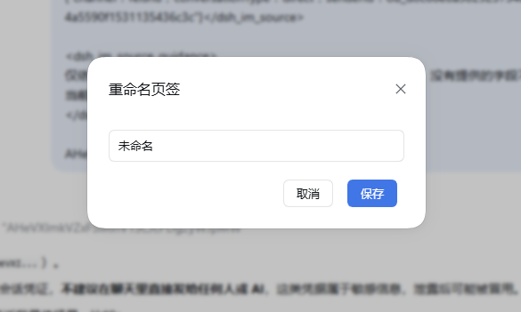

# dsh-plugin-width-slider

[](https://www.npmjs.com/package/dsh-plugin-width-slider)
[](./LICENSE)
[](#环境要求)
[](#环境要求)
[](#环境要求)

> DSH 的一体化界面增强插件：对话宽度、思考块、界面中文化、会话与工作区管理与入场动效。

DSH（DeepSeek Harness）的多功能增强插件。把对话宽度调节、思考块交互、输出语言、界面中文化、设置面板补丁、会话删除、工作区分页与入场动效收进同一个插件，每项功能独立开关、改动即时生效。

## 简介

dsh-plugin-width-slider 面向 DSH 的日常使用场景，补齐官方客户端尚未提供、或使用体验不够顺手的能力：

- **对话宽度**用滑块替代原生拖拽手柄，按下即预览，宽度在重启后保持；
- **思考块**保留官方外观，只定制展开/收起行为（生成中展开、结束后自动收起）；
- **输出语言**通过 host 端 system prompt 注入，强制思考与回复使用简体中文；
- **界面中文化**替换官方残留的硬编码英文标签；
- **面板补丁**让官方设置面板可拖拽调宽（没动过时保持官方尺寸与位置，并随窗口大小自动适配）、左侧导航超高时可滚动；
- **会话删除**补全官方缺失的会话删除能力（二次确认后执行完整删除链）；
- **工作区分页**把侧栏工作区标题行改造成页签栏，支持自建分组；
- **入场动效**为对话内容、侧边栏、新建对话与设置面板提供四组可配置的动效，并按消息角色分流（用户消息侧向滑入、助手正文用所选样式、工具与系统行轻微淡入）。

本插件整合了两个上游插件（dsh-think-zh-expand、dsh-client-ui-custom）的成熟能力，安装本插件后无需再单独安装它们，详见[兼容性与已知限制](#兼容性与已知限制)。

## 目录

- [功能](#功能)
- [环境要求](#环境要求)
- [安装](#安装)
- [快速开始](#快速开始)
- [配置参考](#配置参考)
- [使用说明](#使用说明)
- [界面预览](#界面预览)
- [工作原理](#工作原理)
- [兼容性与已知限制](#兼容性与已知限制)
- [开发](#开发)
- [项目结构](#项目结构)
- [常见问题](#常见问题)
- [更新日志](#更新日志)
- [许可证与致谢](#许可证与致谢)

## 功能

### 对话宽度

- **滑块调节**：以滑块替代官方原生宽度拖拽手柄，拖动实时改变对话内容区宽度。
- **按下即预览**：鼠标按下滑块的瞬间进入预览模式——官方设置面板临时隐藏、对话区透出，屏幕中央显示滑块、当前宽度数值与操作提示，便于直观判断宽度效果；松开或按 Esc 返回设置。
- **宽度持久化**：宽度值写入 `localStorage` 的 `dsh.conversation.contentWidth`，重启 DSH 后启动即应用，无需打开设置页。
- **跟随窗口宽度**：开启后内容宽度实时等于对话列宽，窗口缩放、侧栏折叠、分栏切换均自动跟随；偏好存于 `dsh.conversation.contentWidthFollow`。
- **调节范围**：最小值 640px，最大值 = 对话列宽 − 176px，与官方原生拖拽一致。
- **原生手柄隐藏**：通过稳定属性选择器注入样式隐藏官方左右拖拽手柄，不修改官方 `client.js`，升级不会被覆盖。

### 思考与输出

- **思考块增强**：为思考块提供展开/收起交互（生成中强制展开，结束后按所选模式显示），头部沿用官方 `DisclosureRow` 与官方思考图标，正文为纯文本（与官方 `ReasoningRow` 一致），外观与官方保持一致。
- **显示方式**：二选一——「思考完自动收起」（默认）或「始终展开」。
- **不接管渲染管线**：正式回复文本经官方 `MarkdownText` 渲染，代码块、表格、公式由官方管线处理；围栏（`dsh-ui`、`mermaid` 等）完全交给 genui、dsh-mermaid-render 等专门插件，不存在两套 Markdown 渲染互相压制的问题。
- **强制中文**：host 端注入最高优先级语言规则，思考过程与回复均使用简体中文，代码与术语保持原文。

### 界面

- **界面中文化**：把官方界面残留的硬编码英文标签（Tool Call、Thinking 等）替换为中文。
- **设置面板窗口化**：没动过时与官方完全一致——官方尺寸（宽 800px、高 min(800px, 视口高 − 48px)）、官方居中位置，并随窗口大小自动适配；右下角把手可调整宽高、顶部标题区空白处可拖动移动，此后尺寸与位置被记住，窗口变小时自动收进视口（只改外框，不缩放内容、不改字号）；双击把手复位回官方尺寸与位置。为让把手完整可见，官方弹窗圆角由 32px 收到 16px，把手用「圆角底 + 双斜线」样式并内收 6px。
- **弹窗按比例跟随**（默认关）：开启后弹窗尺寸改按窗口比例（宽 62%、高 82%，保留视口边距）自适应，窗口缩放时弹窗跟着缩放；此模式下尺寸不可拖拽，位置仍可拖。
- **设置导航滚动**：左侧功能列表条目过多时显示纵向滚动条，不再被挤压截断。
- **双语界面**：内置 zh / en 两套文案，跟随 DSH 界面语言自动切换。

### 工作区与会话

- **工作区分页**：官方侧栏「工作区」标题行原位替换为页签栏——固定的「默认」页签加自建命名页签（文件夹）。工作区唯一归属（默认或某个页签），行菜单「分配标签」可移动归属；删除页签时其中的工作区自动回到默认；在其它页签新建工作区会自动归入该页签；重启后回到默认页签。
- **会话删除**：会话行「⋯」菜单新增「删除会话」项（与官方重命名/分叉/归档同级、样式一致）。二次确认后，host 端执行完整删除链：停止任务 → 释放内存 → 删除磁盘日志目录 → 清理投影缓存 → 清理工作区记账，不留残留；删除不可恢复。

### 动效

整合自 [dsh-client-ui-custom](https://github.com/yoli-mi/dsh-client-ui-custom)，设置项收进本插件的功能总控页。

- **四组独立动效**：对话内容入场、侧边栏入场、新建对话入场、设置面板动效，每组独立开关。
- **样式可选**：对话内容 6 种（淡入上浮 / 轻柔淡入 / 上浮放大 / 右侧滑入 / 模糊显影 / 轻盈缩放），侧边栏 4 种（左侧滑入 / 轻柔淡入 / 纵向展开 / 自上而下），新建对话 4 种（轻柔显影 / 轻柔淡入 / 柔和绽放 / 柔和缩放）。
- **时长与手感**：入场时长按意图分档取值——位移/缩放类 `standard`(280–350ms)、纯透明度 `fast`(150–200ms)、新建对话大表面 `medium`(400–500ms)；列表逐项入场步长 70ms，尾部超过 420ms 一起入场；落位类入场（上浮、缩放、面板展开）用带 3% 过冲的 `linear()` 曲线收尾，关闭类动画单独用 `ease-in-expo`。
- **一键预设**：流畅、优雅、极简三套预设，一次写入全部相关字段，应用后仍可逐项微调。
- **按角色入场**：对话行不再共用一种入场——用户消息（含中途插话）从侧面滑入，助手正文用所选样式，工具调用、轮次框架、上下文注入与压缩提示只做 3px 轻微淡入。可在设置页单独关闭。
- **另外四处手感**：思考块展开时正文按自身行数逐行擦出（260–900ms）；宽度滑块甩动松手后按释放速度惯性滑行并回弹（投影 120ms、过冲约 5% 后落回）；会话删除失败时错误行抖一下；设置页打开时页面头与各组以 45ms 步长依次落位（纯 CSS，无 JS 观察器）。

## 环境要求

| 项目 | 要求 |
|---|---|
| 运行环境 | DSH（DeepSeek Harness），Windows 10/11 |
| DSH 版本 | `>= 0.1.5-rc.1` |
| Node.js | `^22.11` 或 `>= 24` |
| 平台 | 仅 `win32` |

> 本插件由浏览器端注入与 host 端两部分组成：`lib/client.js` 注入页面，`lib/index.mjs` 在 host 进程提供 `/api/width-slider` 端点，两者都随 DSH 重启生效。

## 安装

> 下文中的 `<profile>` 指你实际使用的 profile 名。任选一种方式安装后，请**重启 DSH**：host 端 `index.mjs`、client bundle 以及 `/api/width-slider` 端点都需要重启才会生效。

### 方式一：npm 安装（推荐）

```bash
dsh plugin --profile <profile> add dsh-plugin-width-slider
```

### 方式二：源码软链（本地开发）

```bash
cd C:\Users\<用户名>\.dsh\profiles\<profile>
pnpm link C:\path\to\dsh-plugin-width-slider
```

修改代码后执行 `npm run build` 并重启 DSH 即生效，无需复制文件。

### 方式三：手动复制（临时调试）

将构建产物复制到 profile 的 `node_modules` 目录：

```
dsh-plugin-width-slider/
├── package.json
├── cordis.patch.yml
└── lib/
    ├── index.mjs     # Host 端入口
    └── client.js     # Client 端 bundle（ModuleLoader 握手）
```

复制到 `C:\Users\<用户名>\.dsh\profiles\<profile>\node_modules\dsh-plugin-width-slider\`，并在该 profile 的 `package.json` 中把 `"dsh-plugin-width-slider"` 加入 `dsh.profile.bundles` 数组，然后重启 DSH。

### 升级与卸载

- **升级**：重新执行安装命令或替换 `lib/` 产物，重启 DSH 生效；功能开关与各项偏好保留。
- **卸载**：从 profile 中移除插件并重启。宽度偏好等本地数据保留，重新安装后继续可用。

## 快速开始

1. 按上述任一方式安装并重启 DSH。
2. 打开 **设置**，在左侧导航选择 **Width Slider**，进入功能总控页（本插件的全部开关与选项都在这一页）。
3. 按需开关功能：除「跟随窗口宽度」外默认开启，改动即时生效并自动保存；页头右上角「恢复默认设置」可重置全部开关与宽度记忆。

## 配置参考

所有配置位于设置面板的 **Width Slider** 区块，改动即时生效、重启保留。除「跟随窗口宽度」外，各开关默认开启。

### 功能开关

| 分组 | 开关 | 说明 | 默认 |
|---|---|---|---|
| 对话宽度 | 启用对话宽度滑块 | 关闭后恢复官方原生宽度拖拽手柄 | 开 |
| 对话宽度 | 跟随窗口宽度 | 内容宽度实时等于对话列宽；开启后手动拖动不可用 | 关 |
| 思考与输出 | 思考块增强渲染 | 思考块展开/收起交互总开关 | 开 |
| 思考与输出 | 思考/回复强制中文 | host 端注入最高优先级语言规则 | 开 |
| 动效 | 对话入场 | 对话内容入场动效 | 开 |
| 动效 | 侧边栏 | 侧边栏树入场动效 | 开 |
| 动效 | 新建对话 | 新建对话欢迎界面入场动效 | 开 |
| 动效 | 设置界面 | 设置面板展开、页面切换与关闭动效 | 开 |
| 动效 | 按角色入场 | 对话行按角色选择入场：用户消息侧向滑入、助手正文用所选样式、工具与系统行轻微淡入 | 开 |
| 界面 | 界面中文化 | 替换官方残留英文标签 | 开 |
| 界面 | 弹窗可拖拽 | 设置面板窗口化（拖拽调宽高、移动、复位） | 开 |
| 界面 | 弹窗按比例跟随 | 弹窗尺寸按窗口比例（62% × 82%）自适应 | 关 |
| 界面 | tab 栏滚动 | 设置左侧导航超高时显示滚动条 | 开 |
| 界面 | 会话删除 | 会话行「⋯」菜单新增删除项 | 开 |
| 界面 | 工作区分页 | 侧栏工作区标题行改为页签栏 | 开 |

### 样式与预设

| 分组 | 选项 | 可选值 | 默认 |
|---|---|---|---|
| 思考与输出 | 显示方式 | 思考完自动收起 / 始终展开 | 自动收起 |
| 动效 | 对话入场样式 | 淡入上浮 / 轻柔淡入 / 上浮放大 / 右侧滑入 / 模糊显影 / 轻盈缩放 | 淡入上浮 |
| 动效 | 侧边栏样式 | 左侧滑入 / 轻柔淡入 / 纵向展开 / 自上而下 | 左侧滑入 |
| 动效 | 新建对话样式 | 轻柔显影 / 轻柔淡入 / 柔和绽放 / 柔和缩放 | 轻柔显影 |
| 动效 | 预设 | 流畅 / 优雅 / 极简（一次写入全部相关开关与样式） | — |
| 通用 | 恢复默认设置 | 重置全部开关与宽度、设置面板尺寸记忆，并刷新页面 | — |

## 使用说明

### 对话宽度滑块

1. 在总控页确认「启用对话宽度滑块」为开启状态。
2. 鼠标按下滑块并拖动，对话内容区宽度实时变化；按下瞬间进入预览模式，松开或按 Esc 返回设置。
3. 需要随窗口自适应时，勾选「跟随窗口宽度」；此时手动拖动不可用，取消勾选后恢复滑块调节。

### 思考块

- 「思考块增强渲染」关闭时，回退官方默认的单行折叠显示。
- 选择「思考完自动收起」：生成中强制展开，思考结束后收起为单行摘要，点击可再次展开。
- 选择「始终展开」：默认展开，可点击收起。

### 会话删除

1. 点击会话条目右侧的「⋯」打开操作菜单，末尾会出现「删除会话」项。
2. 点击后出现二次确认，确认即永久删除该会话及其全部数据，**不可恢复**。

### 工作区分页

- 开启后，侧栏顶部「工作区」标题位置变为页签栏：最前是固定的「默认」页签，其后是自建页签，末尾「＋」用于新建页签（新建后立即改名）。
- 「默认」页签显示未分组的直属工作区与官方未分组会话；自建页签收纳被分配过去的工作区（同一工作区只属于一个位置）。
- 把工作区移入页签：展开工作区行右侧「⋯」菜单，点击「分配标签」，在弹窗中选择目标页签（或选择「默认」移回）。
- 删除页签：右键页签选择删除，其中的工作区自动回到「默认」，不会丢失。
- 在其它页签下新建工作区时，工作区会自动归入当前页签。
- 重启 DSH 后侧栏回到「默认」页签。

### 入场动效

- 四组动效各自独立开关；关闭某组后，它对应的样式下拉自动置灰。
- 点击「流畅 / 优雅 / 极简」中的任一预设，会一次性写入该预设的全部开关与样式；当前取值与某套预设完全一致时，该预设按钮高亮。
- 动效遵循系统「减少动态效果」设置：系统开启该选项时自动降级为仅淡入。
- 「按角色入场」关闭时，对话行全部回到所选样式（与本插件早期版本的行为一致）。
- 其余手感各有门控：思考块逐行揭示与欢迎标题擦出随对应的入场开关；设置页错峰落位是纯 CSS，只随系统「减少动态效果」开关；宽度滑块的甩动惯性与删除失败抖动始终启用，减少动态效果下自动跳过。

## 界面预览

> 截图与动图来自 DSH 实测，存放于 `image/` 目录。

**宽度滑块 · 按下即预览**


**设置面板窗口化**


**工作区分页**





## 工作原理

| 机制 | 说明 |
|---|---|
| Slot 注入 | `settings.section`（功能总控页，id `width-slider`）、`shell.overlay`（会话删除确认框）、`conversation.chat.node`（思考块渲染器）、`sidebar.workspaces`（工作区分页 wrapper） |
| 宽度应用 | 向每个 `[data-phase]` 对话根元素写入内联 `--dsh-chat-user-width`，与官方 `onHandleDrag` 同路径 |
| 宽度启动恢复 | client 启动即应用持久偏好：跟随模式启用全局 ResizeObserver watcher（观察对话根尺寸、窗口与根增减）；固定值在对话根出现后发布一次 |
| 预览模式 | `createPortal` 挂载到 `document.body`，`position: fixed; inset: 0; z-index: 100000`，同时把 `[data-shell-overlay]` 等设置面板覆盖层设为 `opacity: 0` |
| 思考块渲染 | 覆盖 `conversation.chat.node` 的 `assistant-step` 渲染器（priority −1），只提供展开/收起；头部沿用官方 `DisclosureRow` + `IconThinkOutline14`，正文纯文本 |
| 强制中文 | host 端注册 `systemPrompt.section`（order −90），开关热注销/注册 |
| 界面中文化 | MutationObserver 精确替换「完全等于」词表的叶子文本节点（排除代码与输入区） |
| 面板补丁 | body 观察器以 `[role=dialog][aria-modal]` + `> nav` 语义锚点探测设置面板，不依赖 CSS Module 哈希类名，探测失败安静跳过 |
| 会话删除 | 克隆官方菜单项注入「⋯」菜单，目标会话 id 从会话行 React fiber 直读（避免按标题反查误删）；host 端 `/width-slider` `sessionDelete` 执行删除链，失败即中止并留痕 |
| 工作区分页 | 常驻 wrapper 包裹官方 `sidebar.workspaces`，按当前页签过滤会话与工作区（结果按源引用与作用域缓存，保证 `getSnapshot` 引用稳定）；分组数据经 `/width-slider` `wsGroupsRead/Write` 存 `$DSH_HOME/storages/dsh-plugin-width-slider/workspace-groups.json` |
| 动效 | 命令式 Web Animations 实现（`replayEntrance`），而非 CSS `@starting-style`：宿主挂载行或面板时已强制过一次样式解析，声明式起始态不会生效；观察 `[data-chat-anchor-key]` 消息行与 `[role="tree"] [role="treeitem"]` 侧栏行，整批载入按文档序错峰入场；设置面板动效拦截三条关闭路径，先让真实面板缩小再放行 |
| 动效 | 角色化入场读宿主发布的 `data-chat-flow-kind`（`user`/`steering` → 用户角色，`assistant-step` → 所选样式，其余 → 过程角色）；思考块正文按渲染高度估算行数做 `clip-path` 逐行擦除；宽度滑块取最近 120ms 的指针采样算释放速度，投影 120ms 后由欠阻尼弹簧（k=260、ζ≈0.67）驱动，落点定稿时才写入存储；设置页错峰由 `nth-child` 加一个 CSS 变量步长实现，不经过 JS |
| 配置存储 | 功能开关（含动效开关与样式）经 `/api/width-slider` 端点读写 `$DSH_HOME/storages/dsh-plugin-width-slider/settings.json`（原子写）；client 端 config store 负责热切换 |
| 滑块几何 | 轨道高度等于圆形手柄直径（设置页行内 16px、预览遮罩 28px），填充条右端为与手柄同心同半径的半圆头，无平直切面露出 |
| 性能 | 列宽在 `pointerdown` 时快照，宽度更新经 rAF 节流，拖动不卡顿 |

## 兼容性与已知限制

### 与上游插件的关系

本插件整合了以下上游能力，**安装本插件后无需再单独安装它们**；若同时启用，会出现两套实现争抢同一界面元素的情况，请停用或卸载上游插件。

| 上游插件 | 上游参考版本 | 本插件整合版本 | 整合内容 |
|---|---|---|---|
| [dsh-think-zh-expand](https://github.com/baosfeng/my-dsh-plugins) | v0.4.7 | v0.3.0 | 强制中文、思考块渲染、界面中文化 |
| [dsh-client-ui-custom](https://github.com/yoli-mi/dsh-client-ui-custom) | v0.1.0-rc.12 | v0.8.0 | 四组入场动效与三套预设 |

同时启用时的后果：同一块界面被两个渲染器接管、出现两个按钮与两套设置，或两套动效引擎对同一批 DOM 各自动画一次导致效果叠加。

### 运行环境与内核适配

| 项目 | 说明 |
|---|---|
| 目标内核 | DSH `0.1.5-rc.1`（当前官方内核）。插件只适配该内核，不为更早版本保留兼容分支 |
| Host 入口依赖 | `inject` 声明 `systemPrompt`、`connection`、`subprocess`、`webServer`。端点注册**不用** `connection.rpc.handle`：该调用把路由注册为 `owner.effect(() => owner.webServer.register(route))`，owner 取 connection 自身 ctx，而 0.1.5 的 connection 已不在自身 ctx 注入 `webServer`，第三方插件调用必抛 `cannot get property "webServer" without inject` —— 所以承担路由注册的 fiber 自己必须声明 `webServer` 依赖。注册改走 `connection.fetch.register` 的 `/api` 精确 Fetch 路由 |
| 端点与围栏 | 客户端 `POST /api/width-slider`，请求体为 `{ method, payload }`，响应体为处理器返回的 JSON；围栏由 connection 的 `/api` 处理器统一施加（可信 Host/Origin + 浏览器认证） |
| 已核对稳定的契约 | slot（`conversation.chat.node`、`conversation.session.header.actions`、`settings.section`、`shell.overlay`）、ui-primitives 组件（`MarkdownText`、`DisclosureRow`、`IconThinkOutline14`、`Modal`）、`__ModuleLoader__` 握手、`connection.rpc`、`locale.register`、`sessions.list` 快照、`storageDomain` 的 `session_projcache` 与 `workspace` 域 |

### 验证状态

| 功能 | 状态 |
|---|---|
| 对话宽度滑块、思考块增强、面板补丁 | 已在 DSH 上实测 |
| 会话删除、宽度启动恢复 | 已由作者验收 |
| 工作区分页 | 已由作者验收 |
| 设置页排版重写与动效整合 | 已在 DSH 0.1.5-rc.1 上实测（角色化入场、思考块逐行揭示、滑块惯性回弹、设置页错峰落位逐项核对） |
| 0.1.5 内核适配（RPC 迁移到 `/api` 精确 Fetch 路由） | 已在 DSH 0.1.5-rc.1 上实测（`/api/width-slider` 返回 200，设置读写与各功能开关即时生效） |

### 已知限制

- 仅在 Windows（`win32`）上验证与发布；其它平台未做适配。
- 部分能力依赖官方 DOM 结构（语义锚点与稳定属性选择器），官方大幅重构界面时可能失效；失效时相关补丁安静跳过，不影响其它功能。
- 动效引擎源自上游 dsh-client-ui-custom，1.0.1 起在此基础上自行扩展（角色化入场、逐行揭示、弹簧手感、错峰落位），存在一处极轻量的资源驻留（新建对话入场的一次性观察器与帧回调在极端时序下可能延迟到下一次 DOM 变更才释放），对用户可见行为无影响。

## 开发

```bash
npm install
npm run build      # tsdown 构建 → lib/index.mjs + lib/client.js
npm run typecheck  # TypeScript 类型检查
npm test           # 单元测试（含 jsdom 动效用例）
```

构建产物：

```
lib/
├── index.mjs        # Host 端（ESM）
├── client.js        # Client 端（CJS，含 window.__ModuleLoader__.load 握手）
└── types/           # 类型声明（tsc 产出）
```

测试位于 `test/`（`settingsMotion`、`thinkView` 两个用例文件）；仓库内包含若干参考源码副本（`dsh-src/`、`my-dsh-plugins-main/` 等），已在 `vitest.config.ts` 中排除，不参与测试收集。

### 已知问题

`tsdown 0.6.x` 与 `rolldown 1.2.7` 组合会报
`The requested module 'rolldown/experimental' does not provide an export named 'transformPlugin'`。
请使用 `tsdown >= 0.22`（本仓库已锁定 `^0.22.14` + `rolldown ^1.2.6`）。

## 项目结构

```
dsh-plugin-width-slider/
├── src/
│   ├── index.ts                     # Host 端：systemPrompt 中文注入 + /api/width-slider 端点 + storages 配置
│   ├── host/
│   │   ├── endpointChannel.ts       # /api 下 JSON 端点注册（connection.fetch.register）
│   │   └── sessionDeleteService.ts  # 会话删除链（停任务、删目录、清投影缓存、工作区记账）
│   ├── shared/
│   │   ├── settings.ts              # 功能开关契约（host/client 唯一真源）
│   │   ├── motionSettings.ts        # 动效样式 id、默认值与三套预设
│   │   └── dshHome.ts               # $DSH_HOME 解析
│   └── client/
│       ├── index.ts                 # Client 端入口：locale 注册 + 受控功能生命周期
│       ├── config.ts                # FeatureSettings 契约 + client 配置 store
│       ├── WidthSliderSettings.tsx  # 设置区块：功能总控页
│       ├── WidthSliderControl.tsx   # 宽度滑块组件（按下预览、rAF 拖动、释放惯性与持久化）
│       ├── settingsPanelPatch.ts    # 面板补丁：弹窗窗口化 + 左侧导航滚动
│       ├── widthPrefs.ts            # 宽度偏好读写/发布与启动恢复
│       ├── sessionDelete.ts         # 会话删除菜单项与确认框
│       ├── workspaceTabs.tsx        # 工作区分页：页签栏、分组 store、树过滤 wrapper
│       ├── endpointChannel.ts       # /api 端点调用（POST { method, payload }）
│       ├── think/                   # 思考块渲染器与界面中文化词表
│       ├── motion/                  # 入场动效引擎（对话/侧边栏/新建对话/设置面板）+ 弹簧手感 + 文字擦除
│       ├── lang.ts                  # 界面语言判定
│       └── locales.ts               # zh / en 文案
├── test/                            # 单元测试（含 jsdom 动效用例）
├── scripts/fix-dts-imports.mjs      # 构建后修正 d.ts 相对导入
├── docs/                            # DSH 相关参考文档（非本插件运行时依赖）
├── env.d.ts                         # 运行时模块类型桩
├── cordis.patch.yml                 # bundle patch：insert width-slider
├── tsdown.config.ts
├── tsconfig.json
└── package.json
```

## 常见问题

**Q：重启后对话宽度没有恢复？**
宽度偏好保存在 `localStorage`，client 启动时会立即应用；若宽度未恢复，请确认「启用对话宽度滑块」处于开启状态，且没有其它插件同时写入 `--dsh-chat-user-width`。

**Q：设置里找不到本插件？**
请确认插件已安装到 DSH 的 profile 并已重启。设置项位于 **设置 → Width Slider**。

**Q：和上游插件同时安装会怎样？**
会出现两套实现争抢同一界面元素（两个按钮、两套渲染器或两套动效引擎）。请停用或卸载上游插件，见[与上游插件的关系](#与上游插件的关系)。

**Q：会话删除能恢复吗？**
不能。删除操作会同时清理会话数据、磁盘日志与相关记账，执行前有二次确认。

**Q：动效没有生效？**
请检查对应的动效开关是否开启；若系统启用了「减少动态效果」，动效会自动降级为仅淡入。

**Q：官方升级后某些功能失效？**
部分能力依赖官方 DOM 结构，官方大幅重构界面时可能失效。此时相关补丁会安静跳过，不影响其它功能；请在 [Issues](https://github.com/djs326/dsh-plugin-width-slider/issues) 反馈并附上 DSH 版本号。

## 更新日志

### 未发布

- **侧边栏工具并入新会话行**：工作区标题行的搜索、视图选项、添加工作区三个按钮改由注入样式表钉到「新建会话」同一行，页签行独占整行。宿主 DOM 全程不被搬动 —— 此前的节点搬移实现会在收起侧边栏时让 React 卸载节点抛 `NotFoundError: removeChild`。
- **让位宽度改为文案优先**：先按实测文案宽保证按钮文字完整，剩余宽度才给工具；空间偏紧时收紧间距，仍放不下就不并入并保留宿主布局。修复窄侧边栏下「新会话」被裁成「新会」。
- **避开宿主动画窗口**：宿主的 `rail-in` 关键帧会同时平移「新建会话」按钮与其所在区域，搜索展开时操作区容器自己也带 `translateX` —— 这些 `transform` 一旦出现在被测元素的链上，`position: fixed` 的包含块就会改变、坐标与矩形都不可信，此时跳过测量与发布并保留上一次位置，关键帧结束的 `animationend` 再触发重测。收起落定时先按 rail 宽度还原宿主布局，不必等动画结束。
- **新建页签改为草稿**：点加号只打开对话框，点「保存」才真正创建页签并切过去，取消 / Esc / 点遮罩关闭都不产生任何写入。修复「点取消页签仍被创建」。
- 图片目录 `png/` 改名为 `image/`。

### 1.0.2

- 修复「所有关闭按钮失效」：设置面板动效此前用「模态弹窗 + 导航栏」识别面板、并在该弹窗的父容器里取第一个 `aria-hidden` 元素当遮罩，其它插件带导航的弹窗会被误认，遮罩判断随之命中全页点击并被吞掉。现在只认官方结构（`role="presentation"` 层 + 紧邻的 `aria-hidden` 遮罩兄弟），并在每次点击前复核面板仍然存在；结构不匹配时动效安静降级，不再触碰任何点击。

### 1.0.1

- **只适配 DSH `0.1.5-rc.1` 内核**：插件端点从 `connection.rpc.handle` 迁到 `connection.fetch.register` 的 `/api/width-slider` 精确 Fetch 路由，修复桌面端 2.0.8 上 `cannot get property "webServer" without inject` 导致的插件树加载失败。
- **移除自带的 Open With**：0.1.5 官方已内置头部「Open In...」，其目录是编译期固定白名单、没有自定义项扩展点；自研版本（胶囊按钮、管理面板、`/api/open-with` 与两个开关）整块删除。
- **设置弹窗**：新增「按比例跟随」开关（视口 62%×82%）；右下把手换成圆角底样式并收紧弹窗圆角；没动过时保持官方尺寸与位置。
- **动效**：对话行按角色入场（新增独立开关）、思考块与欢迎标题逐行揭示、宽度滑块松手后惯性回弹、会话删除失败抖动、设置页纯 CSS 错峰落位；时长、缓动与步长按 motion-tokens 刻度校准。
- 修正设置页副标题的开关计数。

### 0.8.1 及更早

0.1.0–0.8.1 共 13 个版本，逐版内容见提交历史。

## 许可证与致谢

本项目以 [MIT](./LICENSE) 许可发布。

思考增强、会话删除与动效能力分别整合或参考自以下 MIT 开源项目，感谢各位开发者：

| 项目 | 作者 | 关系 |
|---|---|---|
| [dsh-think-zh-expand](https://github.com/baosfeng/my-dsh-plugins) | baosfeng | 能力整合（本插件 v0.3.0 起） |
| [dsh-client-ui-custom](https://github.com/yoli-mi/dsh-client-ui-custom) | Yoli-mi | 动效引擎整合（本插件 v0.8.0 起） |
| [dsh-plugin-session-delete](https://github.com/lsz-asd/dsh-plugin-session-delete) | lsz-asd | 会话删除链参考（本插件 v0.5.0 起） |
| [dsh-archived-chats](https://github.com/Ultronen/dsh-archived-chats) | Ultronen | 归档会话删除链参考（本插件 v0.5.0 起） |

许可归属与版权声明明细见 [THIRD_PARTY_NOTICES.md](./THIRD_PARTY_NOTICES.md)。
